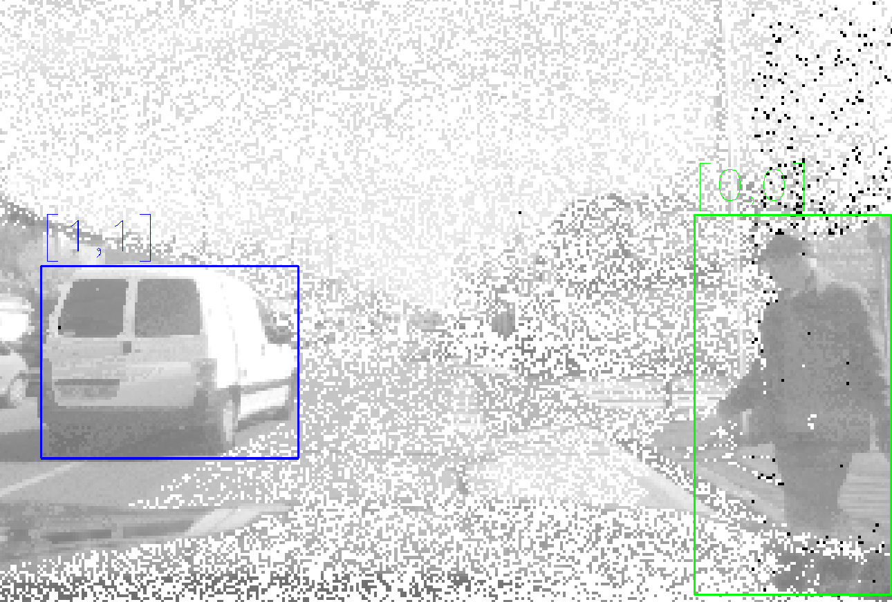

# Machine Learning Labelling Tool

Source: [Prophesee](https://support.prophesee.ai/portal/en/kb/articles/test-machine-learning-labeling-tool)

## Background

To assist the data labelling process, we provide a manual annotating tool to draw bounding boxes on  `.avi` video or `.jpg` image sequences. In this article, we will explain the functionalities of this tool and how to use it in practice.

<figure>
  
  <figcaption>Illustration of the labelling process. The bbox in editing is shown in blue, with the first number indicating the object id, the second number indicating the class category. The added or edited bbox is shown in green.</figcaption>
</figure>

## Introduction

This tool allows you to draw bounding boxes around objects to be detected. Each object is identified by two numbers: `object id` and `class id`. 

- **object id**: the id of the object. Each individual object (each car, pedestrian etc.) should have an unique id number. 
- **class id**: the category number of the object. Before starting your labelling process, you should first define the number of categories. And provide a unique number to each category, like
    ```yaml
    {
      "0": "pedestrian",
      "1": "two wheeler",
      "2": "car",
      ...
    }
    ```

If your input is an `.avi` video, you can label the whole video frame-by-frame. The frame rate (fps) can be defined with argument `-f`. 

If your input is a collection of sequential `.jpg` images, you can label each image in a sequential way. *You only need to pass the 1st image as input, the tool will automatically grab all following images.*

> [!NOTE]
> If you have only event-based recordings at hand, you can use [File to Video Application](https://docs.prophesee.ai/stable/samples/modules/core/file_to_video.html) of Metavision to convert the RAW data to AVI video.

The output contains two files:

- an intermediate `.txt` file: a log file which records all the manual labelling actions on the bounding boxes, such as addition, deletion, resizing etc. 
- a `.npy` file: the standard bbox format used in Metavision ML module, as explained in [this page](https://docs.prophesee.ai/stable/samples/modules/ml/bbox_txt2npy.html). 

## QuickStart

Start by downloading the appropriate version of the labbeling tool depending of the version of Metavision SDK you use:

| SDK version | Tool version |
-|-
up to 2.2.2 | `labelling_tools_up_to_mv_sdk_222.zip`
from 2.3.0 | `labelling_tools_from_mv_sdk_230.zip`

```bash
conda install opencv
conda install -c conda-forge opencv
```

### To launch the first labelling exercise: 

```bash
python3 label_tracking.py -i <path to input> -f <fps of the video>
```

### To verify and fine-tune the label:

```bash
python3 label_tracking.py -i <path to input> -f <fps of the video> -l <label file.txt>
```

By default, a new label will be generated, with the default file name followed by an instantaneous timestamp.

Add `--overwrite` argument if you want to overwrite the existing output. 

Bounding boxes are shown in two colors:

- **Green**: manually set bbox
- **Blue**: bbox selected for edition or being edited

## Some editing instructions

A detailed annotating instruction is shown on the FLY. Here, we list some basic functionalities provided by the tool:

- Hold left click and move the mouse on the scene image to draw a bbox (green).
- Left click on an existing bbox to select it for editing. Once selected, the bbox will turn blue. 
- Hold left click on one of the corners or borders of an existing bbox to resize it.
- While the bbox is selected (in blue), you can press a number key to change the object id. Press the **C** key to switch between class id and object id. Tap Enter key to finish the id modification. 
- **R** key to go to next frame. 
- **E** key to go to previous frame.
- **D** key to delete the selected bbox

> [!NOTE]
> In the original script, a [KCF (Kernelized Correlation Filter) tracker](https://docs.opencv.org/3.4/d2/dff/classcv_1_1TrackerKCF.html) was added to facilitate the annotation process. This function is removed because some annotators find it inconvenient to manually delete and readjust the tracked bounding boxes.

> [!NOTE]
> The tool was only tested in Ubuntu 18 environment. 